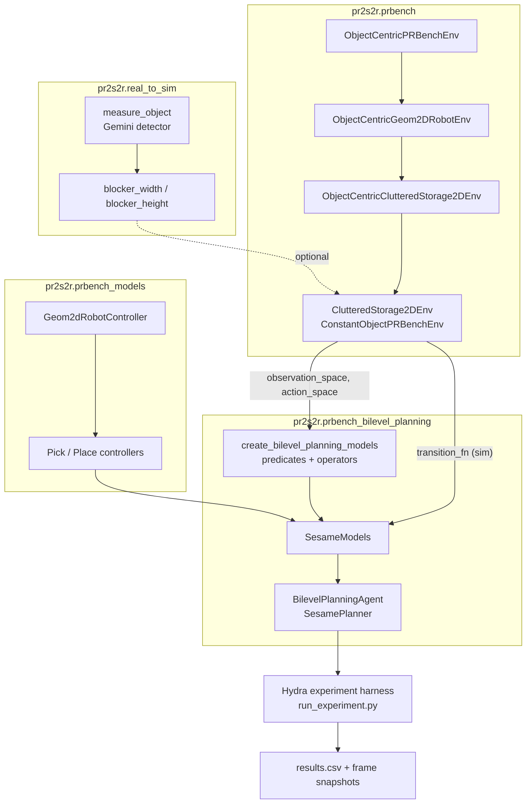

# pr2s2r: PRBench Real-to-Sim with Bilevel Planning


`pr2s2r` (PRBench real-to-sim-to-real) is a research codebase for studying
**long-horizon, object-centric manipulation** in 2D geometric environments
inspired by [PRBench](https://github.com/Princeton-Robot-Planning-and-Learning/prbench).
It pairs a Gymnasium-compatible 2D physical-reasoning environment with a
**bilevel task-and-motion planner** (relational heuristic search over a SeSamE
planner with parameterized continuous controllers) and an experimental
**real-to-sim measurement pipeline** that uses a vision-language object
detector to seed simulator parameters from real photos.

The repository extends a single PRBench-style environment family —
`ClutteredStorage2D` — and provides the planning models, parameterized skills,
and Hydra-driven experiment harness needed to benchmark a TAMP-style agent on
it.

---

## Table of Contents

- [Highlights](#highlights)
- [Overview](#overview)
- [Relationship to PRBench](#relationship-to-prbench)
- [Technical Architecture](#technical-architecture)
- [Core Concepts](#core-concepts)
- [Installation](#installation)
- [Quickstart](#quickstart)
- [Usage Examples](#usage-examples)
- [Environments](#environments)
- [Evaluation and Metrics](#evaluation-and-metrics)
- [Real-to-Sim Pipeline](#real-to-sim-pipeline)
- [Development Workflow](#development-workflow)
- [Adding New Environments or Tasks](#adding-new-environments-or-tasks)
- [Design Philosophy](#design-philosophy)
- [Current Status and Limitations](#current-status-and-limitations)
- [Citation and Acknowledgements](#citation-and-acknowledgements)
- [License](#license)

---

## Highlights

- **PRBench-compatible 2D environment.** `ClutteredStorage2D` (`b1`, `b3`
  variants) implemented as a Gymnasium environment with both an object-centric
  view and a fixed-dimensional `Box`-vectorized view.
- **CRV robot model.** Circle-base + revolute-arm + vacuum-gripper robot with
  a 5-D continuous action space (`dx, dy, dtheta, darm, vacuum`) and explicit
  geometric collision checking against walls, shelves, and clutter.
- **Bilevel TAMP agent.** `BilevelPlanningAgent` wraps the
  `bilevel-planning.SesamePlanner` with a relational heuristic-search abstract
  plan generator and a parameterized-controller trajectory sampler.
- **Symbolic skill library.** Pick/place skills for blocks on and off the
  shelf, each implemented as a parameterized controller with sampleable
  continuous parameters and a motion-planning-backed waypoint generator.
- **Hydra experiment harness.** Reproducible per-seed experiments with
  per-episode CSV metrics, first/last-frame snapshots, and optional
  `RecordVideo` wrapping.
- **Real-to-sim hook (experimental).** Uses
  [`prpl-perception-utils`](https://github.com/Princeton-Robot-Planning-and-Learning/prpl-mono)'
  Gemini-based 2D object detector to measure objects in a real image and
  rescale `blocker_width`/`blocker_height` of the simulator's shelf-blocker
  before evaluation.
- **Engineering hygiene.** `black`, `isort`, `docformatter`, `pylint`, `mypy`
  (strict), `pytest`, and a GitHub Actions CI workflow inherited from the
  underlying Python starter template.

---

## Overview

`pr2s2r` is a **task-and-motion-planning evaluation framework** built around a
single procedurally generated 2D manipulation domain.

The central problem it targets is **long-horizon, geometrically constrained
pick-and-place under spatial clutter**: a mobile-base robot with a 1-DoF
arm and a vacuum gripper must transfer a small set of rectangular target
blocks into a shelf whose opening is partially obstructed by a
geometrically-shaped blocker (rectangular or L-shaped). Solving the task
requires:

- discrete decisions about which block to grasp next and from which side;
- continuous decisions about grasp position, approach angle, arm extension,
  and place location;
- collision-free motion planning around walls, the shelf bookends, and other
  blocks.

Because the action space is continuous and rewards are sparse (success is
detected only when *all* target blocks are inside the shelf), the domain is
designed as a stress test for hierarchical / TAMP-style approaches rather than
flat reinforcement learning. The bundled
[`BilevelPlanningAgent`](src/pr2s2r/prbench_bilevel_planning/agent.py) is the
reference baseline.

The repo is best characterized as:

- a **PRBench-style environment suite**, currently restricted to one family
  (`ClutteredStorage2D`);
- a **planning-models package** containing predicates, operators, lifted
  skills, and parameterized controllers for that family; and
- an **experiment harness** with Hydra configs, plus an experimental
  perception-driven real-to-sim hook.

---

## Relationship to PRBench

PRBench (Princeton Robot Planning and Learning) is a physical reasoning
benchmark for robotics that emphasizes object-centric state, procedural task
generation, and Gymnasium-compatible environments spanning long-horizon
manipulation, contact, and geometric reasoning.

This repository adopts PRBench's core conceptual framework rather than
vendoring its codebase wholesale. Specifically, it **inherits**:

- the **object-centric state abstraction** (states are `ObjectCentricState`
  objects backed by `relational-structs`, with named typed objects and
  per-type feature lists);
- the dual-environment pattern of an `ObjectCentricPRBenchEnv` (variable
  number of objects) and a `ConstantObjectPRBenchEnv` (fixed-dimensional
  `ObjectCentricBoxSpace` for RL-friendly use);
- the **`prbench/<EnvName>-vN`** naming convention, registration helper, and
  `prbench.make(...)` thin wrapper around `gymnasium.make`;
- the **CRV robot** action interface (`dx, dy, dtheta, darm, vacuum`) with
  Markdown-described action and observation spaces.

It **adds / specializes**:

- a from-scratch implementation of `ClutteredStorage2D` with a procedurally
  parameterized shelf, a configurable blocker geometry (`rectangle` or
  `lobject`), and L-shape vs. rectangle collision handling;
- a `prbench_bilevel_planning` package wiring `bilevel-planning`'s
  `SesamePlanner` to the env via predicates, lifted operators, lifted
  parameterized controllers, and a transition function that uses the env
  itself as a forward simulator;
- a `prbench_models` package containing the parameterized
  `Geom2dRobotController` base class and four pick/place controllers for the
  `ClutteredStorage2D` skill set;
- a Hydra-driven experiment script with per-episode metrics CSVs and frame
  dumps;
- an experimental `real_to_sim` module that injects measurements from a
  Gemini-based object detector into the env config before construction.

The relationship is best described as: *this repository builds a focused TAMP
testbed in the PRBench style, with one fully-implemented environment family
and a working bilevel-planning baseline.*

---

## Technical Architecture

### Repository layout

```text
.
├── pyproject.toml                # package + tooling configuration
├── run_autoformat.sh             # black + docformatter + isort
├── run_ci_checks.sh              # full local CI loop
├── apply_configuration.py        # legacy starter-template scaffolding
├── config.json                   # legacy starter-template config
├── src/pr2s2r/
│   ├── prbench/                  # PRBench-style env infrastructure
│   │   ├── __init__.py           #   register_all_environments(), make()
│   │   ├── core.py               #   ObjectCentricPRBenchEnv, ConstantObjectPRBenchEnv
│   │   ├── utils.py              #   demo loading helpers
│   │   └── envs/
│   │       ├── utils.py          #   2D rendering, collision, geom intersection
│   │       └── geom2d/
│   │           ├── base_env.py           # ObjectCentricGeom2DRobotEnv
│   │           ├── object_types.py       # Geom2D, CRVRobot, Rectangle, LObject, ...
│   │           ├── structs.py            # SE2Pose, MultiBody2D, ZOrder
│   │           ├── utils.py              # CRVRobotActionSpace, motion planning, suction
│   │           └── clutteredstorage2d.py # ClutteredStorage2DEnv
│   ├── prbench_models/           # planner-side models / controllers
│   │   ├── utils.py              #   PRBenchParameterizedSkillEnv (skill-level Gym wrapper)
│   │   └── geom2d/
│   │       ├── utils.py                  # Geom2dRobotController base class
│   │       └── envs/clutteredstorage2d/
│   │           └── parameterized_skills.py  # 4 pick/place controllers + factory
│   ├── prbench_bilevel_planning/ # bilevel TAMP agent + experiment harness
│   │   ├── agent.py              #   BilevelPlanningAgent (wraps SesamePlanner)
│   │   ├── env_models/
│   │   │   ├── __init__.py       #   create_bilevel_planning_models() dispatch
│   │   │   └── geom2d/clutteredstorage2d.py  # predicates, operators, skills, SesameModels
│   │   └── experiments/
│   │       ├── run_experiment.py            # Hydra entry point
│   │       ├── create_results_dataframe.py  # results aggregation
│   │       ├── conf/
│   │       │   ├── config.yaml              # global defaults
│   │       │   └── env/clutteredstorage2d-b{1,3}.yaml
│   │       └── logs/                        # generated by Hydra
│   ├── real_to_sim/
│   │   ├── bounding_box.py        # measure_object() via Gemini detector
│   │   └── input*.jpeg            # example real images
│   ├── structs.py / utils.py / test.py     # legacy scaffolding (template)
│   └── py.typed
├── tests/
│   ├── test_envs.py                                  # gymnasium env_checker
│   ├── test_deterministic_demo_replay.py             # demo seed-reset replay
│   ├── test_deterministic_demo_resettable.py         # observation-reset replay
│   └── envs/geom2d/test_clutteredstorage2d.py        # env-specific tests
└── .github/workflows/ci.yml      # autoformat / lint / typecheck / unit-tests
```

### Component diagram



---

## Core Concepts

### Environments

Two layers of `gymnasium.Env`:

- [`ObjectCentricPRBenchEnv`](src/pr2s2r/prbench/core.py) — observations are
  `ObjectCentricState`s with a variable set of typed objects. Used internally
  for planning and as the backing simulator for the transition function.
- [`ConstantObjectPRBenchEnv`](src/pr2s2r/prbench/core.py) — wraps the above
  and converts observations to a fixed-dimensional `numpy` vector via
  `ObjectCentricBoxSpace.vectorize`. This is the form returned by
  `prbench.make("prbench/ClutteredStorage2D-b1-v0")` and is what
  `gymnasium.utils.env_checker.check_env` validates against in
  [`tests/test_envs.py`](tests/test_envs.py).

### Object-centric states and types

Object types are defined in
[`object_types.py`](src/pr2s2r/prbench/envs/geom2d/object_types.py):

- `Geom2DType` (parent): `x, y, theta, static, color_r/g/b, z_order`.
- `RectangleType`, `CircleType`, `LObjectType`, `DoubleRectType`, plus the
  domain-specific `TargetBlockType` and `ShelfType`.
- `CRVRobotType`: `x, y, theta, base_radius, arm_joint, arm_length, vacuum,
  gripper_height, gripper_width`.

A per-type feature dictionary (`Geom2DRobotEnvTypeFeatures`) is consumed by
`relational-structs` to produce typed states whose vectorization is
deterministic.

### Action space

The CRV robot uses
[`CRVRobotActionSpace`](src/pr2s2r/prbench/envs/geom2d/utils.py), a
`gymnasium.spaces.Box` subclass with a Markdown-aware description and 5
continuous components: base translation `(dx, dy)`, base rotation `dtheta`,
arm extension `darm`, and a continuous vacuum command `vac` ∈ `[0, 1]`. The
action bounds in `ClutteredStorage2DEnvConfig` are deliberately small
(`5e-2` translation per step, `π/16` rotation per step) so that long-horizon
plans contain hundreds to thousands of low-level actions.

### Procedural generation

[`ObjectCentricClutteredStorage2DEnv._sample_initial_state`](src/pr2s2r/prbench/envs/geom2d/clutteredstorage2d.py)
samples a valid initial scene by:

1. placing the shelf at a fixed `y` near the top of the world;
2. drawing in-shelf blocks with rotations sampled from
   `target_block_in_shelf_rotation_bounds`;
3. drawing out-of-shelf blocks from `target_block_out_of_shelf_pose_bounds`;
4. rejection-sampling against `state_2d_has_collision` up to
   `max_init_sampling_attempts` times.

### Reward, termination, and step dynamics

Step dynamics are implemented in
[`ObjectCentricGeom2DRobotEnv.step`](src/pr2s2r/prbench/envs/geom2d/base_env.py)
and consist of: (1) integrate the action, (2) snap any objects suctioned in
the *previous* step to the gripper using the previously-recorded relative SE2
transform, (3) propagate contact-induced motion to other movable objects, and
(4) reject the entire transition if it would produce a collision (the state
simply does not advance — there is no compliance model).

The `ClutteredStorage2D` reward is sparse and step-based: see
`_get_reward_and_done` in
[`clutteredstorage2d.py`](src/pr2s2r/prbench/envs/geom2d/clutteredstorage2d.py).
Termination occurs when every `TargetBlockType` object satisfies
`is_inside_shelf`. The accompanying test
`test_clutteredstorage2d_termination` confirms a reward of `-1.0` at the
terminal step in the current implementation, consistent with a per-step cost.

### Bilevel planning models

[`create_bilevel_planning_models`](src/pr2s2r/prbench_bilevel_planning/env_models/geom2d/clutteredstorage2d.py)
returns a `bilevel_planning.SesameModels` bundle containing:

- **predicates**: `Holding(robot, block)`, `HandEmpty(robot)`,
  `OnShelf(block, shelf)`, `NotOnShelf(block, shelf)`;
- **operators**: `PickBlockNotOnShelf`, `PickBlockOnShelf`,
  `PlaceBlockNotOnShelf`, `PlaceBlockOnShelf`, with standard
  `add_effects`/`delete_effects` over those predicates;
- **state abstractor** that derives the abstract state from a concrete
  `ObjectCentricState` using `get_suctioned_objects` and `is_inside_shelf`;
- **goal deriver** that asks for `OnShelf(block, shelf)` for every target
  block;
- **transition function** that resets a private
  `ObjectCentricClutteredStorage2DEnv` to the queried state and steps it once
  — i.e., the simulator *is* the planner's forward model;
- **lifted skills** binding each operator to a parameterized controller from
  `prbench_models`.

### Parameterized controllers

[`Geom2dRobotController`](src/pr2s2r/prbench_models/geom2d/utils.py) is the
shared base class. Each concrete controller (e.g.
`GroundPickBlockNotOnShelfController`) implements:

- `sample_parameters(state, rng)` — draws a continuous parameter vector (e.g.
  a grasp ratio over block edges and an arm length);
- `_generate_waypoints(state)` — produces a list of `(SE2Pose, arm_length)`
  waypoints, frequently calling `run_motion_planning_for_crv_robot` for
  collision-free base navigation;
- `_get_vacuum_actions()` — returns `(during_plan, after_plan)` vacuum
  commands so a single skill encodes both motion and gripper toggling.

The base class then converts waypoints into a per-step `(dx, dy, dtheta,
darm, vac)` action sequence respecting the action-space bounds and emits a
final vacuum-toggle action. Failures during sampling raise
`TrajectorySamplingFailure`, which the SeSamE planner uses to refine its
samples.

### Skill-level Gym wrapper

[`PRBenchParameterizedSkillEnv`](src/pr2s2r/prbench_models/utils.py) is a
companion `gymnasium.Env` whose actions are
`ParameterizedSkillReference(name, objects, params)` symbolic objects rather
than raw arrays. Stepping such an env executes the named ground skill in the
underlying simulator until termination and aggregates rewards. This is not
used by the experiment runner today but provides a clean interface for
hierarchical baselines.

### Configuration system

Experiments use [Hydra](https://hydra.cc/). The default tree is
[`experiments/conf`](src/pr2s2r/prbench_bilevel_planning/experiments/conf/):

```text
conf/
├── config.yaml                # seed, num_eval_episodes, planner hyperparameters
└── env/
    ├── clutteredstorage2d-b1.yaml
    └── clutteredstorage2d-b3.yaml
```

Each `env/*.yaml` carries `make_kwargs` (passed to `prbench.make(...)`) and
`env_model_kwargs` (passed to `create_bilevel_planning_models`), enabling
sweeps via Hydra multirun.

---

## Installation

The project requires **Python ≥ 3.10**. CI runs on Python 3.10. Several
dependencies are direct git references to the
[`prpl-mono`](https://github.com/Princeton-Robot-Planning-and-Learning/prpl-mono)
monorepo (`bilevel-planning`, `relational-structs`, `tomsgeoms2d`,
`prpl-utils`, `prpl-perception-utils`, `prpl-llm-utils`); these will be
fetched via `pip` / `uv` at install time.

### Using `uv` (matches CI)

```bash
git clone <repo-url>
cd python-starter-main
uv python install 3.10
uv sync --all-extras --dev
```

After `uv sync`, prefix commands with `uv run`, e.g. `uv run pytest tests/`.

### Using a virtualenv + pip

```bash
git clone <repo-url>
cd python-starter-main
python3.10 -m venv .venv
source .venv/bin/activate
pip install -e ".[develop]"
```

The `develop` extra adds `black`, `isort`, `docformatter`, `mypy`, `pylint`,
`pytest-pylint`, and `pytest`.

### System / optional dependencies

- The `unit-tests` CI job installs `liblapack-dev libblas-dev` on
  `ubuntu-latest`. Equivalent system packages may be needed for `numpy` /
  `scipy` builds on bare systems.
- The real-to-sim pipeline depends on `prpl-perception-utils`'
  `GeminiObjectDetector2D`. Using it requires the corresponding API
  credentials, which `bounding_box.py` loads via `python-dotenv` from a `.env`
  file. **No real-to-sim code path is exercised by the test suite**, so a
  default install does not need it to be configured.

---

## Quickstart

After installation:

```python
from pr2s2r import prbench

prbench.register_all_environments()
env = prbench.make("prbench/ClutteredStorage2D-b1-v0", render_mode="rgb_array")

obs, info = env.reset(seed=0)
for _ in range(10):
    action = env.action_space.sample()
    obs, reward, terminated, truncated, info = env.step(action)
    if terminated or truncated:
        break

frame = env.render()  # numpy uint8 array (H, W, 3)
env.close()
```

`obs` is a fixed-dimensional `numpy` vector backed by an
`ObjectCentricBoxSpace`; `env.action_space` is the 5-D
`CRVRobotActionSpace`.

For the object-centric (variable-object) interface, instantiate the
underlying class directly, as in
[`tests/envs/geom2d/test_clutteredstorage2d.py`](tests/envs/geom2d/test_clutteredstorage2d.py):

```python
from pr2s2r.prbench.envs.geom2d.clutteredstorage2d import (
    ObjectCentricClutteredStorage2DEnv,
)

env = ObjectCentricClutteredStorage2DEnv(num_blocks=1)
state, info = env.reset(seed=123)
print(state.pretty_str())
```

A small driver script demonstrating the same flow lives in
[`src/pr2s2r/test.py`](src/pr2s2r/test.py).

---

## Usage Examples

### 1. Render a scene

```python
import matplotlib.pyplot as plt
from pr2s2r import prbench
from pr2s2r.prbench.envs.geom2d.clutteredstorage2d import (
    ObjectCentricClutteredStorage2DEnv,
)

prbench.register_all_environments()
env = ObjectCentricClutteredStorage2DEnv(num_blocks=3)
env.reset(seed=0)
plt.imsave("scene.png", env.render())
```

### 2. Run the bilevel-planning experiment harness

The Hydra entry point lives at
[`src/pr2s2r/prbench_bilevel_planning/experiments/run_experiment.py`](src/pr2s2r/prbench_bilevel_planning/experiments/run_experiment.py).
Example invocations (paths are illustrative — adapt to your shell):

```bash
cd src/pr2s2r/prbench_bilevel_planning/experiments

python run_experiment.py env=clutteredstorage2d-b1 seed=0
python run_experiment.py -m env=clutteredstorage2d-b3 seed='range(0,10)'
python run_experiment.py -m env=clutteredstorage2d-b1 seed=0 \
    samples_per_step=1,5,10
```

Each run produces, under `logs/<date>/<time>/`:

- `results.csv` — per-episode `success`, `steps`, `planning_time`;
- `episode_<i>_first_frame.png` and `episode_<i>_last_frame.png`;
- the resolved `config.yaml`, plus `.hydra/` metadata.

The number of evaluation episodes is currently hard-coded to `25` inside
`run_experiment.py`; `cfg.num_eval_episodes` is defined in `config.yaml` but
is **not** read by the loop today. Treat the hard-coded value as authoritative
until this is reconciled.

### 3. Aggregate results across runs

```bash
python create_results_dataframe.py \
    --results_dir logs/2025-12-02/14-10-20 \
    --config_columns env.env_name env.make_kwargs.id seed max_abstract_plans samples_per_step
```

This walks all subdirectories containing both `results.csv` and `config.yaml`,
joins them on the chosen config columns, and prints a grouped mean over
seeds.

### 4. Run the test suite

```bash
pytest tests/                     # unit tests
./run_ci_checks.sh                # full local CI loop
```

`run_ci_checks.sh` calls `run_autoformat.sh` (black + docformatter + isort),
then `mypy .`, then `pytest . --pylint -m pylint`, then `pytest tests/`.

---

## Environments

The registry currently exposes the `ClutteredStorage2D` family. Counts come
from `prbench/__init__.py`'s `register_all_environments()` loop.

| Environment ID                      | Domain               | Blocks | Observation                                                | Action                       | Reward    | Status |
| ----------------------------------- | -------------------- | -----: | ---------------------------------------------------------- | ---------------------------- | --------- | ------ |
| `prbench/ClutteredStorage2D-b1-v0`  | 2D pick-and-place    | 1      | `Box` (vectorized object-centric, fixed-dim)               | `Box(5)` CRV robot           | sparse, terminal | implemented |
| `prbench/ClutteredStorage2D-b3-v0`  | 2D pick-and-place    | 3      | `Box` (vectorized object-centric, fixed-dim)               | `Box(5)` CRV robot           | sparse, terminal | implemented |

The variable-object form (`ObjectCentricClutteredStorage2DEnv(num_blocks=N)`)
can be instantiated for arbitrary `N` directly, but only `N ∈ {1, 3}` are
registered through `gymnasium.registry`.

Inherited type / scene primitives (`Rectangle`, `Circle`, `LObject`,
`DoubleRect`, `CRVRobot`) and their collision/rendering implementations are
present and exercised, but no other PRBench environment family is implemented
in this repo.

---

## Evaluation and Metrics

Per-episode metrics produced by the experiment harness:

| Metric           | Source                                                                                | Notes                                                                                            |
| ---------------- | ------------------------------------------------------------------------------------- | ------------------------------------------------------------------------------------------------ |
| `success`        | env termination after `done=True`                                                     | Boolean; `True` only when *all* target blocks satisfy `is_inside_shelf`.                          |
| `steps`          | low-level env steps before `done` or `max_eval_steps`                                  | `cfg.max_eval_steps` defaults to `3000`.                                                          |
| `planning_time`  | wall-clock time spent inside `agent.reset()` / `agent.step()` / `agent.update()`      | Measured with `prpl_utils.utils.timer`. Excludes simulator step time.                            |
| `eval_episode`   | episode index within the run                                                           | Used as a join key when aggregating across seeds.                                                 |

Frames (`episode_<i>_first_frame.png`, `episode_<i>_last_frame.png`) are
emitted regardless of outcome, including on planner failure
(`AgentFailure`). Optional MP4 recording is enabled by setting
`make_videos=True` in the Hydra config; this wraps the env with
`gymnasium.wrappers.RecordVideo`.

Planning hyperparameters that affect cost vs. success:

- `max_abstract_plans` (default `10`)
- `samples_per_step` (default `3`)
- `max_skill_horizon` (default `100`)
- `heuristic_name` (default `"hff"`)
- `planning_timeout` (default `30 s`)

No formal benchmark *scoreboard* is committed to the repo; the `logs/`
directory contains historical Hydra outputs from individual runs but is not
reduced into a published table here.

---

## Real-to-Sim Pipeline

The
[`pr2s2r/real_to_sim/bounding_box.py`](src/pr2s2r/real_to_sim/bounding_box.py)
module exposes:

```python
@dataclass
class Measurement:
    total_width: float
    total_height: float
    thickness: float

def measure_object(image_path: str, output_path: str = "boxed_output.png") -> Measurement: ...
```

`measure_object` runs `GeminiObjectDetector2D` (wrapped by
`RenderWrapperObjectDetector2D` for visualization) against the prompts
`"horizontal pretzel box"` and `"vertical pretzel box"`. It then post-processes
the returned bounding boxes into a `Measurement`:

- if two boxes share a top edge → `total_width` is the sum of widths;
- if two boxes share a right edge → `total_height` is the sum of heights;
- otherwise it falls back to the single-box dimensions.

`run_experiment.py` exposes a `cfg.real_image_path` field. When set, it calls
`measure_object`, divides the returned dimensions by `1500.0` to convert
pixels to simulator units, and overrides `blocker_width` / `blocker_height`
inside `cfg.env.make_kwargs` before construction. The detected object's
visualization is dumped to `<run_dir>/detected_object.png`.

This path is **experimental**: the prompts and the `1500.0` scale factor are
hard-coded for the current example imagery (`input.jpeg`, `input_2.jpeg`),
and there are no automated tests that exercise the perception step.

---

## Development Workflow

The repository inherits the
[`tomsilver/python-starter`](https://github.com/tomsilver/python-starter)
template, which provides:

- **Formatting** — `black` (line length 88), `isort` (black-compatible),
  `docformatter`. Run via [`./run_autoformat.sh`](run_autoformat.sh).
- **Static type checking** — `mypy` in strict-equality mode with explicit
  `ignore_missing_imports` overrides for the `prpl-*`, `bilevel_planning`,
  `tomsgeoms2d`, `gymnasium`, `hydra`, `matplotlib`, `pandas`, and `dill`
  packages.
- **Linting** — `pylint` via `pytest-pylint`, configured in `.pylintrc`.
- **Tests** — `pytest`, with `tests/` as the entry point. The deterministic
  demo replay tests are parameterized over any `*.p` files placed under a
  top-level `demos/` directory; they are no-ops when no demos are present.
- **CI** — [`.github/workflows/ci.yml`](.github/workflows/ci.yml) defines four
  jobs: `autoformat`, `linting`, `static-type-checking`, `unit-tests`.
- **Local CI loop** — [`./run_ci_checks.sh`](run_ci_checks.sh) chains
  autoformat → mypy → pylint → pytest.

The legacy starter files (`apply_configuration.py`, `config.json`, and
`src/pr2s2r/{structs,utils,test}.py`) remain in the tree and are intentionally
not removed yet; they are not used by the PRBench code paths.

---

## Adding New Environments or Tasks

The current code supports only one environment family, but the abstractions
are generic. A reasonable contribution flow:

1. **Define new object types** (or reuse existing ones) by extending
   `Geom2DRobotEnvTypeFeatures` in
   [`object_types.py`](src/pr2s2r/prbench/envs/geom2d/object_types.py).
2. **Subclass `ObjectCentricGeom2DRobotEnv`** with implementations of
   `_create_constant_initial_state_dict`, `_sample_initial_state`,
   `_get_reward_and_done`, and (if needed) `get_objects_to_move`.
3. **Subclass `ConstantObjectPRBenchEnv`** to expose a fixed-dimensional
   observation space with `_get_constant_object_names` and the various
   `_create_*_markdown_description` hooks.
4. **Register** the new environment in
   [`prbench/__init__.py`](src/pr2s2r/prbench/__init__.py) following the
   existing `_register(...)` pattern with `id="prbench/<Name>-vN"`.
5. **Implement parameterized controllers** by subclassing
   `Geom2dRobotController` and exposing a `create_lifted_controllers` factory
   in `prbench_models/geom2d/envs/<env_name>/parameterized_skills.py`.
6. **Wire planning models** in
   `prbench_bilevel_planning/env_models/geom2d/<env_name>.py`, providing
   predicates, lifted operators, a state abstractor, a goal deriver, and the
   `SesameModels` bundle.
7. **Add a Hydra env config** at
   `prbench_bilevel_planning/experiments/conf/env/<env_name>.yaml`.
8. **Add tests** mirroring the structure under
   [`tests/envs/geom2d/`](tests/envs/geom2d/).
9. **Verify** locally with `./run_ci_checks.sh`.

The dispatch loader in
[`env_models/__init__.py`](src/pr2s2r/prbench_bilevel_planning/env_models/__init__.py)
already searches both `geom2d/` and `tidybot3d/` directories by env name, so
a future TidyBot3D family can plug in without changes to the loader.

---

## Design Philosophy

A few intentional choices worth flagging:

- **The simulator *is* the forward model.** The bilevel planner's transition
  function instantiates a private `ObjectCentricClutteredStorage2DEnv` and
  calls `reset(options={"init_state": ...})` followed by `step(u)` for every
  query. This guarantees planner/executor consistency at the cost of planner
  latency. The `reset(options={"init_state": ...})` contract is therefore
  load-bearing and is unit-tested in
  `test_clutteredstorage2d_move_block` and the deterministic-replay tests.
- **Object-centricity over flat vectors.** The fixed-dim `Box` observation
  exists for compatibility (and is what the registered env returns), but
  every planner-side operation works on `ObjectCentricState` and uses
  `ObjectCentricBoxSpace.devectorize` to round-trip. This keeps relational
  structure visible to predicates and operators.
- **Continuous action, discrete commitment.** The CRV action space is
  continuous on every dimension including vacuum, but the operator semantics
  treat suction as a discrete latching event triggered by the controller's
  `_get_vacuum_actions`. Step dynamics resolve this by reading the
  *previous* step's suction state when applying contact updates.
- **Sparse, geometric success.** Termination uses `is_inside_shelf` rather
  than a shaped distance; this is intentional and makes the domain a useful
  stress test for hierarchical methods.

---

## Current Status and Limitations

What works today:

- `prbench/ClutteredStorage2D-b{1,3}-v0` pass `gymnasium.utils.env_checker.check_env`.
- Procedural reset, deterministic seeding, and observation-based reset (via
  `options={"init_state": ...}`) all hold under the deterministic-replay
  tests when demos are provided.
- The bilevel-planning agent solves both `b1` and `b3` configurations under
  the default Hydra hyperparameters; `logs/2025-12-*` contains historical
  outputs (these are local artifacts and are not authoritative results).

Known limitations / experimental areas:

- **Only one environment family is registered.** The
  [`env_models/__init__.py`](src/pr2s2r/prbench_bilevel_planning/env_models/__init__.py)
  loader references a `tidybot3d/` path that does not exist in this tree.
- **No baselines beyond bilevel planning.** No RL, imitation, or LLM agent
  is implemented in this repo. `PRBenchParameterizedSkillEnv` exists but is
  not currently consumed.
- **No demonstration data is committed.** `find_all_demo_files` looks under
  a `demos/` directory that is not present, so the deterministic-replay
  tests are effectively no-ops in a fresh checkout.
- **Real-to-sim is single-purpose.** The detector prompts and pixel→world
  scale factor are tailored to the bundled example images and the
  `clutteredstorage2d` blocker geometry only. There is no scale calibration,
  no camera intrinsics, and no automated test coverage.
- **`run_experiment.py` hard-codes 25 evaluation episodes,** ignoring
  `cfg.num_eval_episodes`.
- **Legacy template scaffolding remains.** `config.json`,
  `apply_configuration.py`, and `src/pr2s2r/{structs,utils,test}.py` are
  carried over from the python-starter template and are not part of the
  PRBench code path.
- **No published quantitative results.** The repository contains run logs
  but no aggregate success-rate or planning-time tables.

A natural roadmap, supported by the existing structure:

1. Promote one or more PRBench environments (e.g. `Obstruction2D`,
   `StickButton2D`) into this repo to broaden the benchmark surface.
2. Replace the hard-coded episode count and surface video / metrics
   configuration through Hydra fully.
3. Add at least one learning-based baseline (RL or behavior cloning) over
   the `Box`-vectorized environment, plus a parameterized-skill baseline
   over `PRBenchParameterizedSkillEnv`.
4. Generalize `real_to_sim` with calibrated metric scaling and a unit test
   that runs against a stub detector.

---

## Citation and Acknowledgements

This project builds on ideas and / or code from
[PRBench](https://github.com/Princeton-Robot-Planning-and-Learning/prbench),
a physical reasoning benchmark for robotics developed by the Princeton Robot
Planning and Learning group. It also depends directly on packages from the
[`prpl-mono`](https://github.com/Princeton-Robot-Planning-and-Learning/prpl-mono)
monorepo: `bilevel-planning`, `relational-structs`, `tomsgeoms2d`,
`prpl-utils`, `prpl-perception-utils`, and `prpl-llm-utils`.

The repository scaffolding (CI, autoformat / lint setup, `pyproject.toml`
template) is derived from
[`tomsilver/python-starter`](https://github.com/tomsilver/python-starter).

---

## License

Released under the MIT License — see [`LICENSE`](LICENSE) for the full text.
